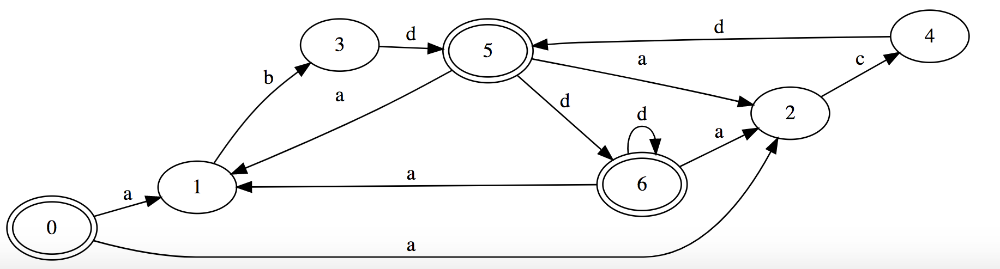
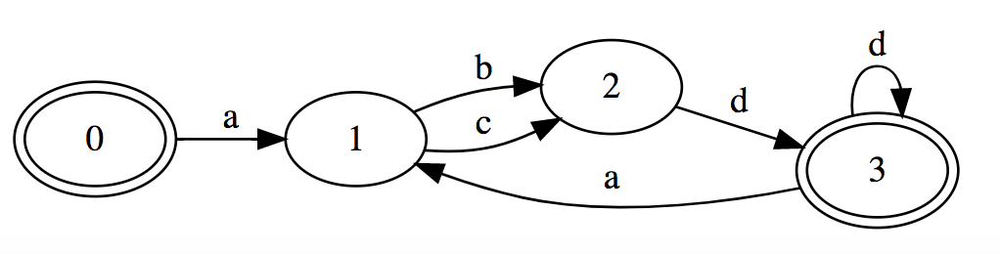

# FSA Streamliner for Regular Expressions

TLDR;

Turn this:



Into this!



----

This program provides tools for streamlining finite state automata. They include:
- Recognizer: will determine if a given string is valid according to a given FSA. (regex)
- Determinizer: will determinize a non-deterministic FSA. (more efficient)
- Reverser: will reverse any FSA
- Minimiser: will minimise any FSA, using the Brzozowski algorithm

This is a maven project written in java. You can use the command line to run the maven tests, but there is no kind of user interface for using the program from the command line.

To use the project:
- Open the project in a web editor such as IntelliJ 
- Go to the tests directory
- Observe how to construct a regular expression in the directory ExpressionTest
- Go to the test directory of any of the other operations to try them out
- add your code to the bottom of the list of examples
- run the code, copy/paste the console output to a [visualisation](http://www.webgraphviz.com/) tool

Example:
My favourite example is the final of the MinimizeNFATest test cases
```
// ((ab|ac)d+)*
        Expression expr = Expr.star(Expr.concat(Expr.or(Expr.str("ab"), Expr.str("ac")), Expr.plus(Expr.ch('d'))));
        System.out.println(expr);
        NFA nfa = expr.compile();
        DFA minDFA = NFAOperations.minimize(nfa);

        System.out.println(nfa.toDot());
        System.out.println(minDFA.toDot());
```
The three System.outs will print the dot code for the regex before and after operations have been applied. The pictures show how cool it is!

The output will look like this
```
digraph G {
rankdir=LR;
0 [peripheries=2];
0 -> 1 [label="a"];
1 -> 2 [label="b"];
1 -> 2 [label="c"];
2 -> 3 [label="d"];
3 [peripheries=2];
3 -> 1 [label="a"];
3 -> 3 [label="d"];
}
```
This describes the modified finite state automaton.
To see what it looks like, use an online visulaisation tool such as [webgraphviz](http://www.webgraphviz.com/), and copy/paste the digraph description.

Looking at the before and after for the minimisation example of the quite complex regex ((ab|ac)d+)*:

We see the before image, of the raw FSA


Then we see the after image, representing a much more efficient FSA.
This is after using the determinize and reversal methods, which are part of the Brzozowski technique of minimisation.

Much more efficient!

Enjoy! 
